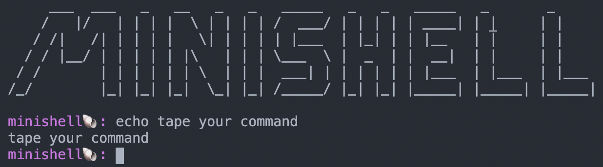

# MINISHELL
"As beautiful as a shell"

## Objective

The objective of this project is to create a simple shell.

(learn a lot about processes and file descriptors)

## Execution

`make run`

## Screenshot

