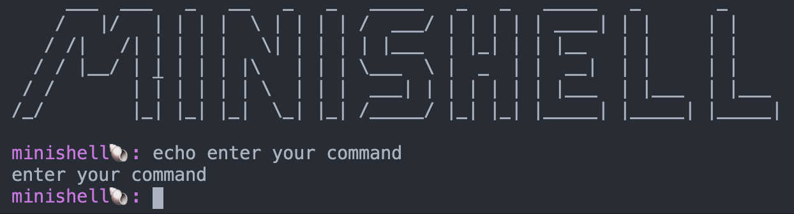

# MINISHELL
*"As beautiful as a shell"*

## Objective

The objective of this project is to create a simple shell.

(learn a lot about processes and file descriptors)

## Usage
```
$ git clone https://github.com/adbenoit-9/42_minishell.git
$ cd 42_minishell/
```
### Execution
```
$ make run
[command]
```
or
```
$ make ; ./minishell -c [command]
```

## Preview



*In collaboration with @mabriand-42 :two_hearts:*
